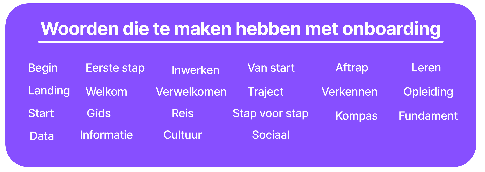

import { Card, Aside } from "@astrojs/starlight/components";
import image from "../../../assets/namestorm.png";

Voor het platform werd gezocht naar een korte, sterke en pakkende naam. Hiervoor is
eerst een brainstormsessie gehouden waarin woorden werden verzameld die verband houden
met onboarding.

Vanuit deze lijst is vervolgens gekeken naar Griekse en Latijnse vertalingen, omdat
deze vaak krachtig en tijdloos klinken.

Enkele voorbeelden:

- **Eerste stap**: Primus gradus
- **Begin**: Initium
- **Welkom**: Salve! (enkelvoud) / Salvete (meervoud)
- **Opleiding**: Educatio
- **Van start**: Ab initio of Initium facere
- **Inwerken**: Initiatio of Inductio
- **Fundament**: Fundamentum
- **Toegang**: Aditus

Uiteindelijk is gekozen voor **SALVE**, de Latijnse
vertaling van “Welkom”. Deze naam sluit perfect aan bij de kern van het platform:
nieuwe medewerkers een warm welkom geven.
