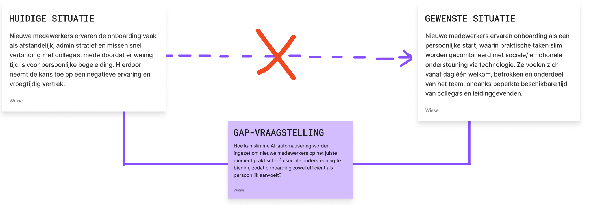
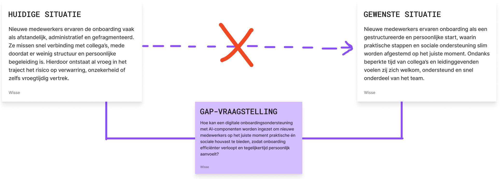

import designGapOne from "../../../assets/design-gap/design-gap-one.png";
import designGapTwo from "../../../assets/design-gap/design-gap-two.png";

In de beginfase van het onderzoek bood het eerste Design Gap een richting.
Deze formulering hielp om een startpunt te bepalen, maar naarmate mijn
inzichten groeiden, werd duidelijk dat de eerst-opgestelde versie niet
meer volledig aansloot. De nadruk lag te sterk op AI als oplossing, terwijl
het concept zich juist richt op digitale ondersteuning die mensgericht,
contextueel en ondersteunend is.

Daarom is de Design Gap aangepast. Hoewel de kern hetzelfde blijft,
sluit de nieuwe versie beter aan op de daadwerkelijke doelstelling:
_het slimmer en persoonlijker maken van onboarding, zonder dat het onmenselijk
of volledig geautomatiseerd aanvoelt._

Hieronder is weergegeven hoe de Design Gap er in eerste instantie uitzag.

  

### Nieuwe Design Gap

Vervolgens ben ik een aantal aanpassingen door gaan voeren:

- Ik ben afgestapt van de benaming _“Slimme AI-automatisering”_
  en ben het gaan omschrijven als een _“digitale
  onboardingsondersteuning met AI-componenten”_, om zo de nadruk te verschuiven van
  AI naar ondersteuning en het beeld van een koude AI-tool te vermijden.
- Ik heb meer nadruk gelegd op het feit dat nieuwe medewerkers de menselijke begeleiding
  missen en ook op sociale binding, om zo een beter beeld te geven van wat 'persoonlijk'
  betekent in mijn context.
- Ik ben mijn taalgebruik beter gaan afstemmen op mijn visie; 
  technologie ondersteunt, maar vervangt niet.  Zo gebruik ik geen AI-automatisering
  en digitale tool meer, maar gebruik ik AI-componenten en digitale ondersteuning.

Hieronder zie je mijn vernieuwde design gap.

  
