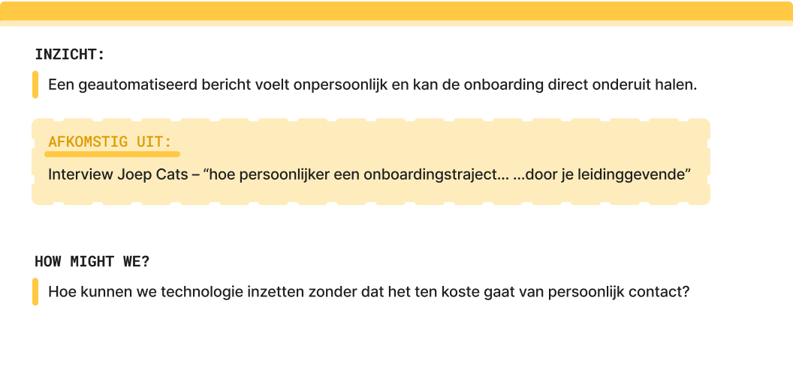
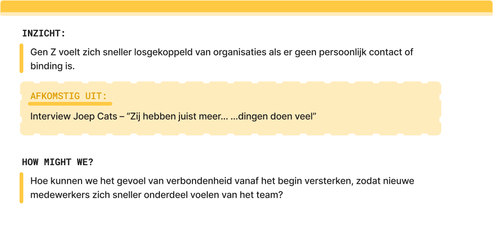
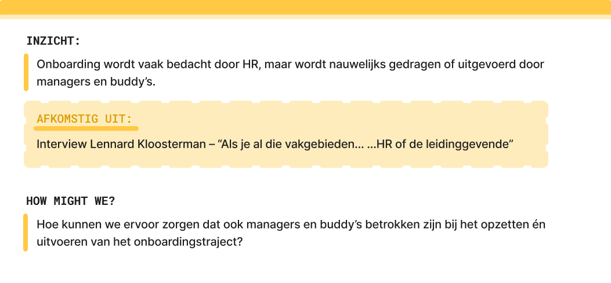
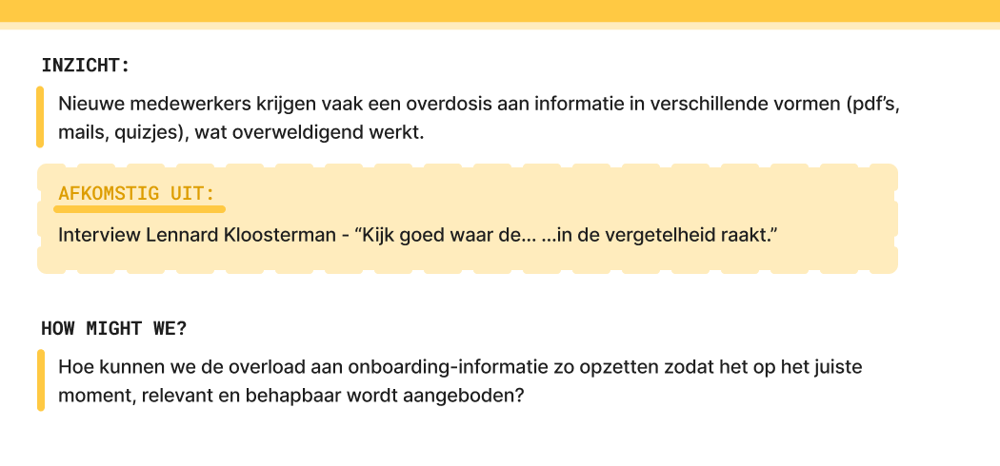
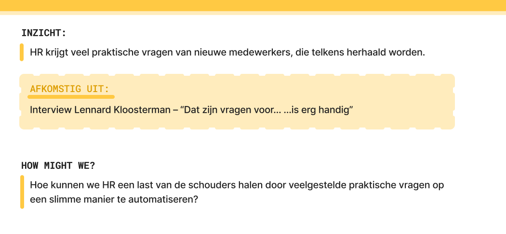
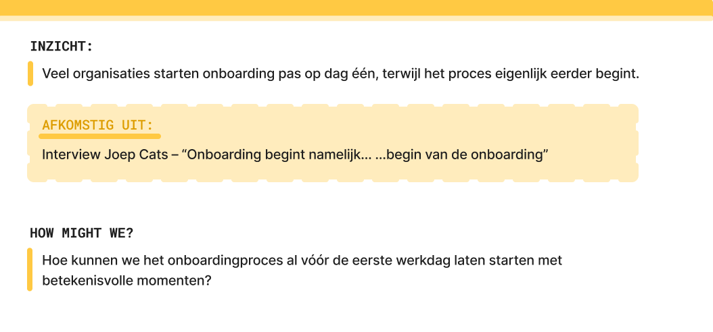

import geautomatiseerd from "../../../assets/hmw/geautomatiseerd.png";
import genZ from "../../../assets/hmw/gen-z.png";
import hrProject from "../../../assets/hmw/hr-project.png";
import infoOverdosis from "../../../assets/hmw/info-overdosis.png";
import praktischeVragen from "../../../assets/hmw/praktische-vragen.png";
import teLateOnboarding from "../../../assets/hmw/te-late-onboarding.png";

De How Might We-vragen hebben ook een belangrijke waarde in mijn framingstraject.
Waar eerdere methodes vooral gebaseerd zijn op deskresearch, komen deze HMW's
direct voort uit mijn fieldresearch, met name de interviews met HR- en
onboardingexperts.

Deze methode helpt me om concrete, open ontwerpvragen te formuleren op basis
van échte praktijkervaringen. In plaats van meteen naar oplossingen te grijpen,
stel ik gerichte vragen zoals:
_“Hoe kunnen we informatie meer gespreid aanbieden?”_ of 
_“Hoe kunnen we HR helpen om persoonlijke begeleiding efficiënter te organiseren?”_

Zo maak ik de bruggetje tussen probleem en oplossing, en zorg ik dat mijn
ontwerp aansluit op wat er echt nodig is.

### Aanpak

Zoals hierboven genoemd, zijn voor het opstellen van de How Might We's uitsluitend
de onderzoeksresultaten uit de interviews gebruikt. Met behulp van kunstmatige
intelligentie zijn de belangrijkste en overlappende punten tussen de verschillende
gesprekken geanalyseerd en samengebracht. Dit leverde uiteindelijk zes kerninzichten
op, die de basis vormden voor de formulering van de How Might We-vragen.

### How Might We Vragen

  

  

  

  

  

  

### En verder...

De zes opgestelde vragen vormen samen de fundatie van het probleemveld waarin
mijn ontwerpopgave zich afspeelt. Elk van deze vragen belicht een specifieke
uitdaging binnen het onboardingproces, van praktische knelpunten tot
sociaal-emotionele behoeften.

In de vervolgfase zijn deze HMW's samengebracht en geanalyseerd om tot één
overkoepelende [Design Challenge](/framing/design-challenge/) te komen.
Deze centrale ontwerpvraag vat de losse onderdelen samen in één heldere
richting, en vormt zo het fundament voor de conceptontwikkeling.
