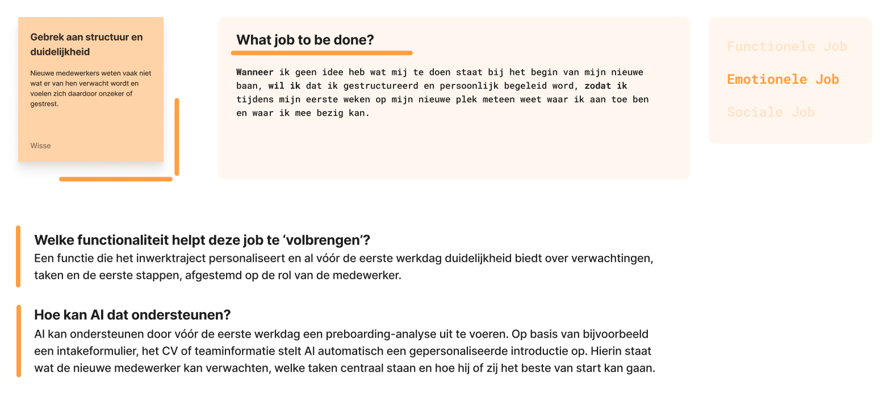
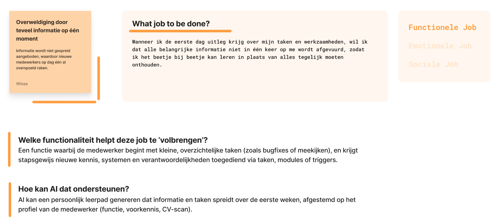
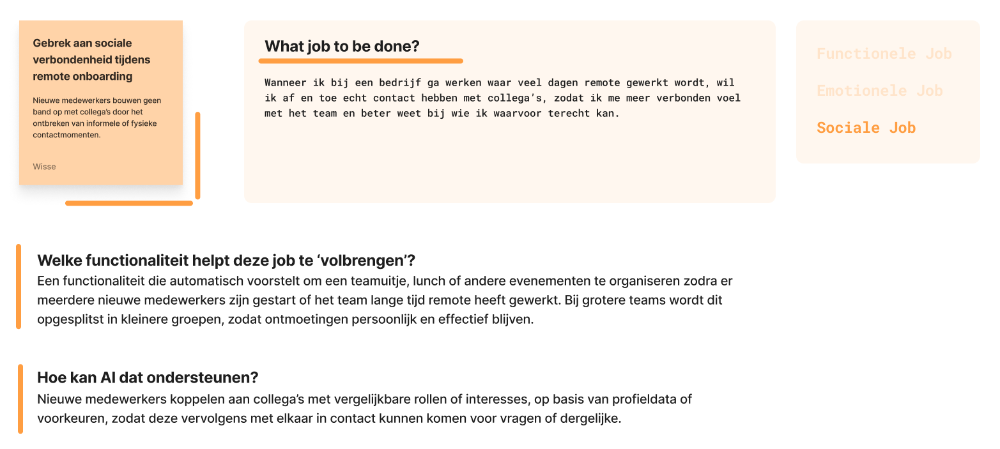
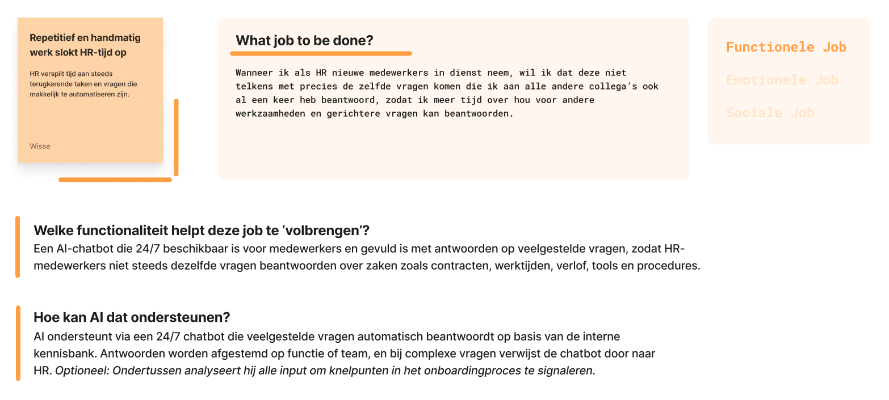
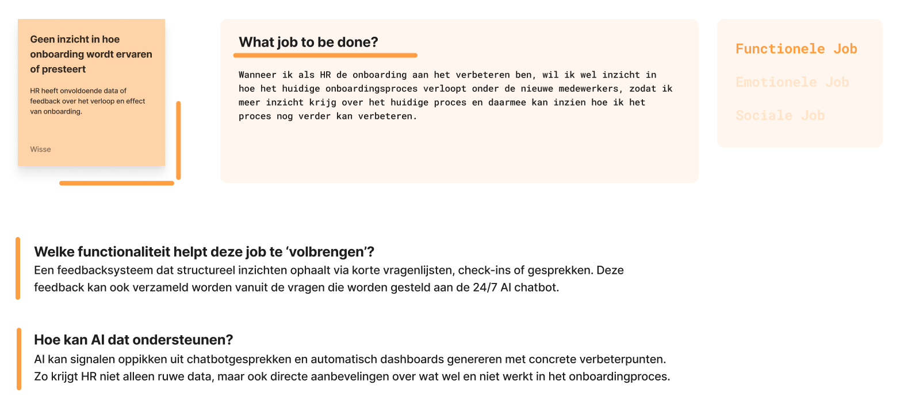
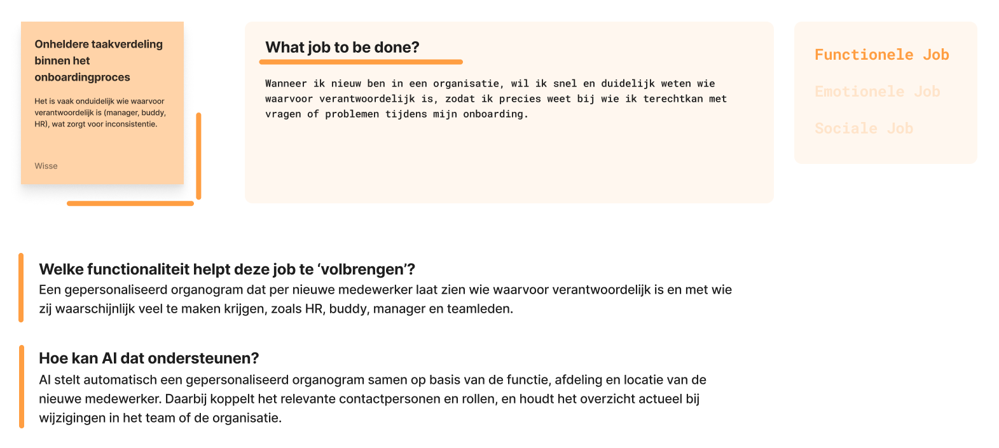

import { Steps } from "@astrojs/starlight/components";
import jtbdGeenInzicht from "../../../assets/jtbd/JTBD-geen-inzicht.png";
import jtbdOverweldigd from "../../../assets/jtbd/JTBD-overweldigd.png";
import jtbdRepetitief from "../../../assets/jtbd/JTBD-repetitief.png";
import jtbdStructuur from "../../../assets/jtbd/JTBD-structuur.png";
import jtbdTaakverdeling from "../../../assets/jtbd/JTBD-taakverdeling.png";
import jtbdVerbondenheid from "../../../assets/jtbd/JTBD-verbondenheid.png";

Met het toepassen van de Jobs To Be Done-methode wil ik beter begrijpen wat
gebruikers écht proberen te bereiken in het onboardingproces. In plaats van te
focussen op losse functies of wensen, helpt deze methode mij om de onderliggende
doelen en motivaties van gebruikers zichtbaar te maken, zoals “ik wil weten wie
mijn aanspreekpunt is” of “ik wil me zeker voelen in mijn nieuwe rol.”

Door deze 'klussen' te formuleren, kan ik mijn AI-oplossing gerichter ontwerpen
rond de werkelijke context van de gebruiker. Dit voorkomt oppervlakkige features
en zorgt ervoor dat mijn tool aansluit op wat mensen nodig hebben op dat moment
in hun onboardingtraject.

### Nieuwe Pijnpunten

In de voorgaande stap van de framingfase, de Value Proposition, zijn in totaal
dertien pijnpunten opgesteld. Om de tijd efficiënt te besteden, is besloten dit
aantal terug te brengen. Op basis van de resultaten uit de Value Proposition zijn
de meest urgente pijnpunten geselecteerd en samengevoegd tot zes hoofdpunten.

Deze zes pijnpunten vormden de basis voor de toepassing van de Jobs to be Done-methode.
De pijnpunten die in deze stap centraal staan, zijn als volgt:

- **Gebrek aan structuur en duidelijkheid**  
  Nieuwe medewerkers weten vaak niet wat er van hen verwacht wordt en
  voelen zich daardoor onzeker of gestrest.

- **Overweldiging door teveel informatie op één moment**  
  Informatie wordt niet gespreid aangeboden, waardoor nieuwe medewerkers op dag
  één al overspoeld raken.

- **Gebrek aan sociale verbondenheid tijdens remote onboarding**  
  Nieuwe medewerkers bouwen geen band op met collega's door het ontbreken van
  informele of fysieke contactmomenten.

- **Repetitief en handmatig werk slokt HR-tijd op**  
  HR verspilt tijd aan steeds terugkerende taken en vragen die makkelijk te
  automatiseren zijn.

- **Geen inzicht in hoe onboarding wordt ervaren of presteert**  
  HR heeft onvoldoende data of feedback over het verloop en effect van onboarding.

- **Onheldere taakverdeling binnen het onboardingproces**  
  Het is vaak onduidelijk wie waarvoor verantwoordelijk is (manager, buddy,
  HR), wat zorgt voor inconsistentie.

### Aanpak

De methode is op de volgende manier toegepast:

<Steps>

1. **Selecteren van de belangrijkste problemen vanuit de Value Propositions**

2. **Het formuleren van een 'Job'-zin per pijnpunt**

   - _Wanneer ik ..., wil ik ..., zodat ik ...._

3. **Het clusteren van de Jobs op soort, waarin onderscheid gemaakt is tussen:**

   - **Functionele Jobs:** _"Ik wil toegang tot systemen zonder dat ik vijf keer moet inloggen"_
   - **Emotionele Jobs:** _"Ik wil me op dag 1 welkom en niet onzeker voelen"_
   - **Sociale Jobs:** _"Ik wil indruk maken door snel zelfstandig te kunnen werken"_

4. **Koppel de Jobs aan de Onboardingstool**
   - _Welke functionaliteit helpt deze Job te 'volbrengen'?_
   - _(Hoe) kan AI dat ondersteunen?_

</Steps>

### Resultaten

  

  

  

  

  

  
