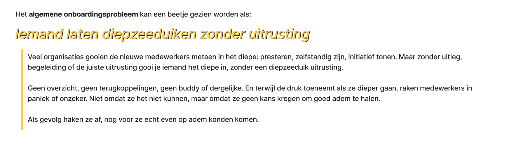
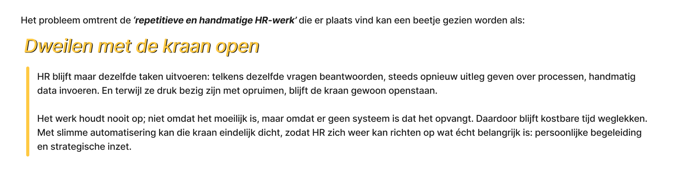
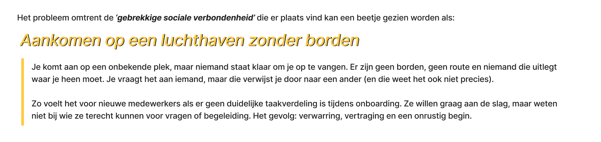
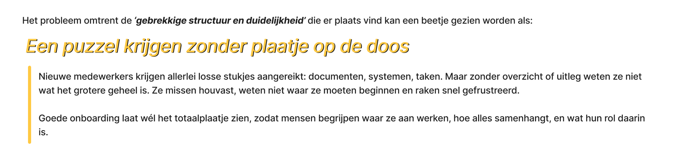
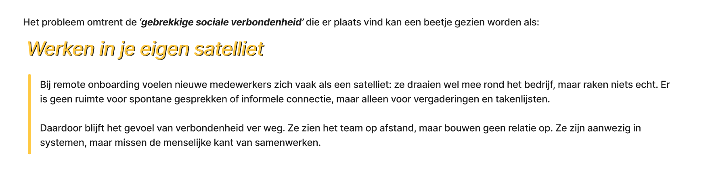
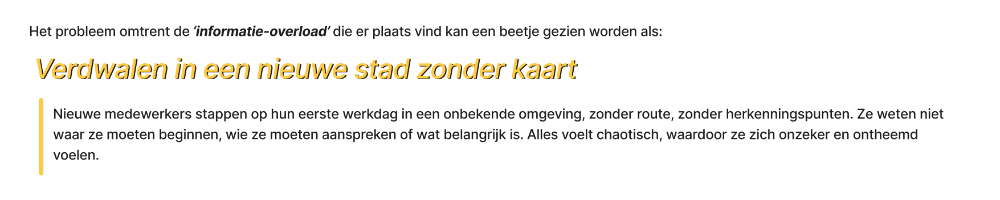
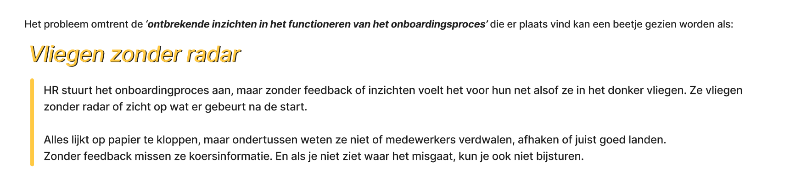

import diepzeeduiken from "../../../assets/metaforen/diepzeeduiken.png";
import dweilen from "../../../assets/metaforen/dweilen.png";
import luchthaven from "../../../assets/metaforen/luchthaven.png";
import puzzle from "../../../assets/metaforen/puzzle.png";
import sateliet from "../../../assets/metaforen/sateliet.png";
import verdwalen from "../../../assets/metaforen/verdwalen.png";
import vliegen from "../../../assets/metaforen/vliegen.png";

Om abstracte problemen binnen het onboardingproces beter te begrijpen en over
te brengen, maak ik gebruik van metaforen. Deze helpen mij én anderen om de
lastige situaties te vertalen naar herkenbare beelden of ervaringen uit het
dagelijks leven.

Een goede metafoor maakt een ongrijpbaar probleem ineens tastbaar. In plaats
van te praten over 'gebrek aan structuur' of 'sociale isolatie', kan ik deze
situaties verbeelden als bijvoorbeeld “verdwalen in een onbekende stad zonder
kaart” of “binnenkomen op een feestje waar je niemand kent”. Dit soort beelden
roepen direct gevoel op en maken het eenvoudiger om mee te denken over
mogelijke oplossingen.

Door metaforen in te zetten, breng ik meer empathie en verbeelding in mijn
ontwerpproces en wordt het eenvoudiger om mijn ontwerpkeuzes te onderbouwen
en communiceren richting anderen.

### Metaforen

Als eerste is het algemene onboardingsprobleem onder de loep genomen
en hiervoor is een metafoor opgesteld:

Daarna zijn dezelfde pijnpunten die eerder in de Jobs to be Done-methode
zijn gebruikt, als uitgangspunt genomen om ook voor de overige pijnpunten
passende metaforen te ontwikkelen, om zo beeldend en toegankelijk inzichtelijk
te maken.
  

  

  

  

  

  

:::caution[Kleine toevoeging]
Hoewel het opstellen van metaforen onderdeel was van mijn algemene framingaanpak,
kijk ik er in retrospectief anders op terug. Ik heb gemerkt dat deze methode voor
mij persoonlijk weinig heeft toegevoegd aan het onderzoek.

Wel zie ik een mogelijke waarde in het inzetten van de metaforen tijdens de
eindpresentatie, om buitenstaandersop een toegankelijke en beeldende manier snel
inzicht te geven in de probleemstelling.
:::
