import { Steps, Tabs, TabItem } from "@astrojs/starlight/components";
import valuePropositionCanvas from "../../../assets/value-proposition/vptemplate.png";
import numberOne from "../../../assets/value-proposition/gebrek-structuur-duidelijkheid.png";
import numberTwo from "../../../assets/value-proposition/te-veel-info.png";
import numberThree from "../../../assets/value-proposition/remote-werken.png";
import numberFour from "../../../assets/value-proposition/mismatch-verwachting-realiteit.png";
import numberFive from "../../../assets/value-proposition/geen-voortganggevoel.png";
import numberSix from "../../../assets/value-proposition/repetitieve-taken.png";
import numberSeven from "../../../assets/value-proposition/administratief-moment.png";
import numberEight from "../../../assets/value-proposition/onduidelijke-rolverdeling.png";
import numberNine from "../../../assets/value-proposition/geen-goede-feedback.png";
import numberTen from "../../../assets/value-proposition/verouderde-systemen.png";
import numberEleven from "../../../assets/value-proposition/gebrek-aan-personalisatie.png";
import numberTwelve from "../../../assets/value-proposition/eenmalige-fase.png";
import numberThirteen from "../../../assets/value-proposition/niet-menselijk.png";

Met het maken van een Value Proposition wil ik helder in kaart brengen welke
waarde mijn oplossing biedt voor de eindgebruiker. Door de pijnpunten, behoeftes
en gewenste resultaten van zowel nieuwe medewerkers als HR-professionals te
koppelen aan concrete functies van mijn AI-onboardingmodule, krijg ik beter
inzicht in hoe mijn concept daadwerkelijk problemen oplost en waarde toevoegt.

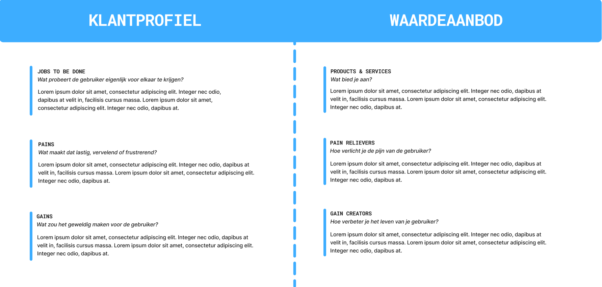

Het canvas helpt mij om mensgericht te ontwerpen: de linkerkant (**klantprofiel**)
gebruik ik om via onderzoek te ontdekken wat gebruikers nodig hebben, waar ze
tegenaan lopen en waar ze blij van worden. De rechterkant (**waardeaanbod**)
gebruik ik zodra er een concept ontstaat, om te toetsen of het ontwerp aansluit
bij die inzichten. Zo werkt het canvas als een soort spiegel: ik zie niet alleen
wat ik maak, maar ook voor wie en waarom het waardevol is. Dat helpt me om
ontwerpkeuzes bewuster te maken en te kunnen onderbouwen.

## Uitwerking

Voor het opstellen van de pijnpunten is gebruikgemaakt van Kunstmatige Intelligentie.
Alle voorgaande onderzoeksresultaten zijn hiermee geanalyseerd en samengebracht,
waarna de belangrijkste knelpunten naar voren kwamen. Deze zijn vervolgens geordend
in drie hoofdcategorieën: _pijnpunten voor nieuwe medewerkers, pijnpunten voor HR en
werkgevers_, en _technologische en systematische pijnpunten_.

### Pijnpunten

<Steps>

1. **Pijnpunten voor nieuwe medewerkers**

   - **Gebrek aan structuur en duidelijkheid.**
      
     _Effectory & Gallup:_ Gebrek aan duidelijke verwachtingen leidt tot stress en
     verhoogt uitstroom.
   - **Te veel informatie in één keer (overload).**
      
     _TriNet & Appical:_ 81% voelt zich overweldigd; gefaseerde informatieaanpak
     voorkomt dit.
   - **Weinig tot geen sociale aansluiting.**
      
     _Tilburg University & ECKM:_ Remote onboarding vergroot gevoel van isolatie,
     verbinding is cruciaal.
   - **Mismatch tussen verwachting en realiteit.**
      
     _Volberda (2023):_ Onduidelijke rolverwachting leidt tot teleurstelling en afhaken.
   - **Geen gevoel van voortgang of erkenning.**
      
     _Gallup:_ Goede begeleiding en feedback verhogen tevredenheid en inzetbaarheid.
        

2. **Pijnpunten voor HR en werkgevers**

   - **Repetitieve, handmatige taken kosten veel tijd**
      
     _Doorless & Parasa:_ 45% van HR-tijd gaat naar handmatig werk
   - **Onboarding vaak gezien als een administratief moment in plaats van een doorlopend traject**
      
     _RecruitmentTraining.pro:_ HR wil medewerkers vanaf dag 1 betrokken maken, maar
     onboarding is vaak versnipperd en zonder structuur
   - **Onduidelijke rolverdeling binnen teams maakt onboarding onsamenhangend**
      
     _ECKM:_ HR streeft naar consistente onboarding, maar mist een duidelijke taakverdeling
     tussen manager, buddy en team.
   - **Geen structurele feedback of meting van effect**
      
     _Integron-interview:_ HR mist data en inzichten om onboarding effectief te sturen
     of verbeteren.
        

3. **Technologische en systematische pijnpunten**

   - **Verouderde HR-systemen en versnipperde tools**
      
     _Doorless (2025):_ HR besteedt 45% van de tijd aan handmatig werk omdat systemen
     niet geïntegreerd zijn.
      
     _Vlerick Business School:_ Slechts 5% van de organisaties heeft een gestructureerd
     en langdurig onboardingtraject.
   - **Gebrek aan personalisatie**
      
     _Harbinger & IJCEM:_ AI kan onboarding afstemmen op rol, locatie en kennisniveau,
     maar dat gebeurt vaak nog niet.
      
     _Gallup:_ Slechts 12% van medewerkers vindt dat onboarding goed is ingericht.
   - **Onboarding wordt gezien als een eenmalige fase**
      
     _Tilburg University:_ Onboarding is een langdurig proces, niet iets dat na dag
     één stopt.
      
     _RecruitmentTraining.pro:_ Onboarding wordt te vaak verward met een ‘inwerkdag’
     of IT-checklist.
   - **AI of digitale tools voelen niet menselijk genoeg**
      
     _ECKM & Harbinger:_ Digitale formats zijn niet genoeg voor verbondenheid; er
     is actieve sociale interactie nodig.
      
     _Tilburg University:_ Gebrek aan informele momenten (zoals buddy’s) belemmert
     sociale integratie.

</Steps>

### Resultaten

Het Canvas kent twee zijden: de linkerkant, het klantprofiel, en de rechterkant,
het waardeaanbod. Binnen de framingsfase is besloten dat de linkerkant belangrijker
is, omdat deze zich richt op het in kaart brengen van de gebruiker en diens
behoeften. De rechterkant sluit meer aan bij de conceptfase, waarin
oplossingsrichtingen worden uitgewerkt. Om die reden is er in deze fase alleen de
linkerkant ingevuld en is de rechterkant bewust doorgestreept in de canvassen.
Deze wordt later opnieuw opgepakt in de conceptfase (zie [Value Proposition 2.0](/framing/value-proposition-2.0/)).

Hieronder zijn de resultaten van alle klantprofielen te zien.

<Tabs>
<TabItem label="Nieuwe medewerkers">

**Gebrek aan structuur en duidelijkheid:**
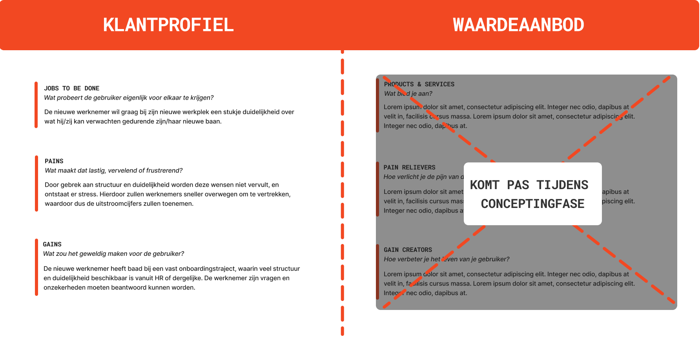

**Te veel informatie in één keer (overload):**
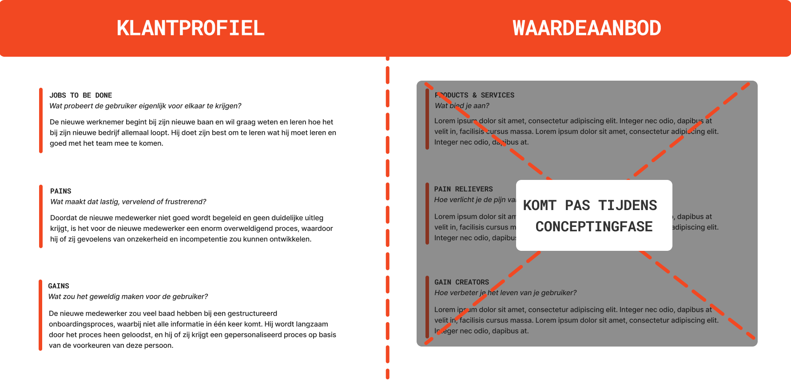

**Weinig tot geen sociale aansluiting:**
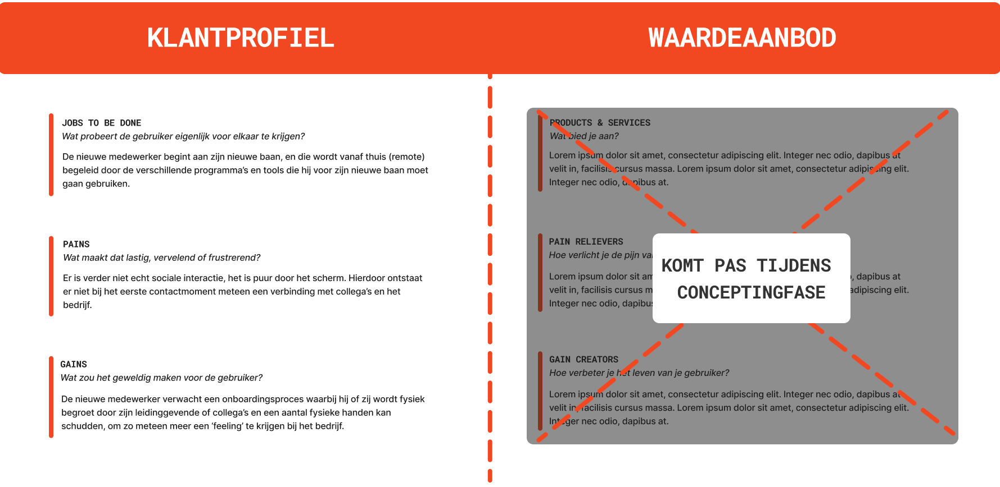

**Mismatch tussen verwachting en realiteit:**
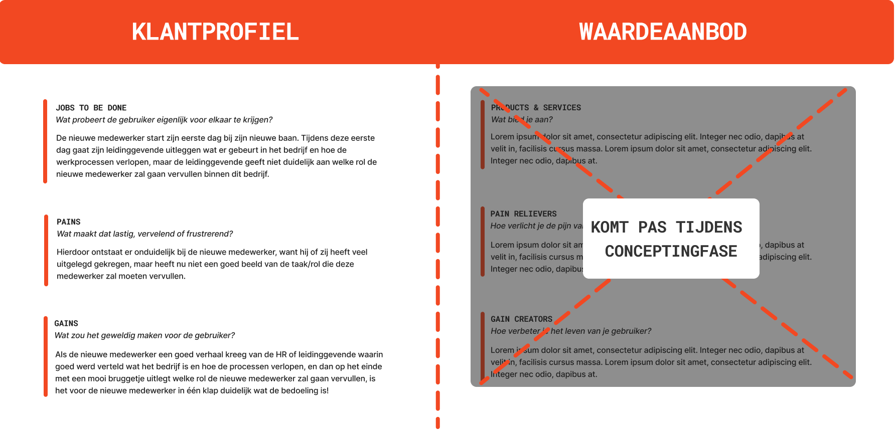

**Geen gevoel van voortgang of erkenning:**
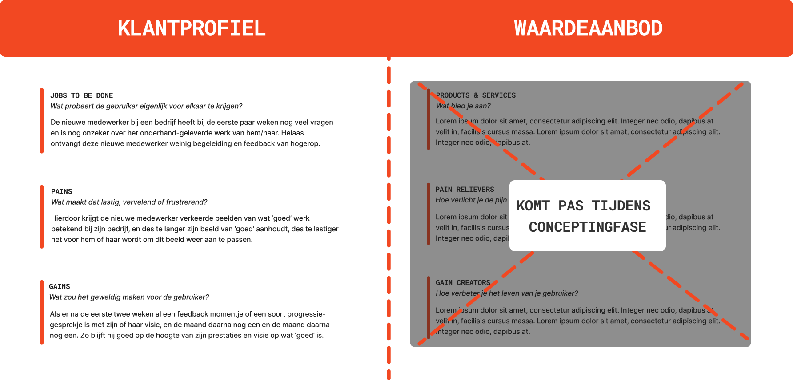

</TabItem>
<TabItem label="HR en werkgevers">

**Repetitieve, handmatige taken kosten veel tijd:**
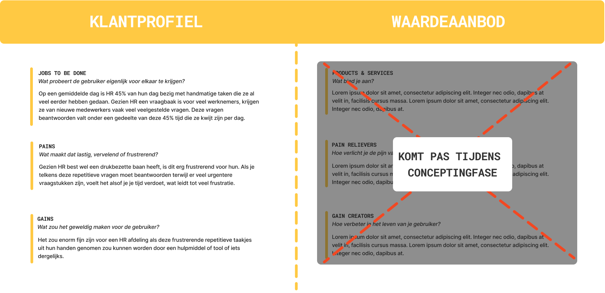

**Onboarding vaak gezien als een administratief moment in plaats van een doorlopend traject:**  
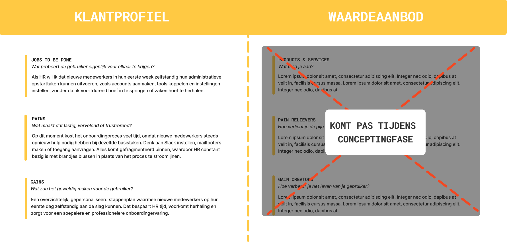

**Onduidelijke rolverdeling binnen teams maakt onboarding onsamenhangend:**
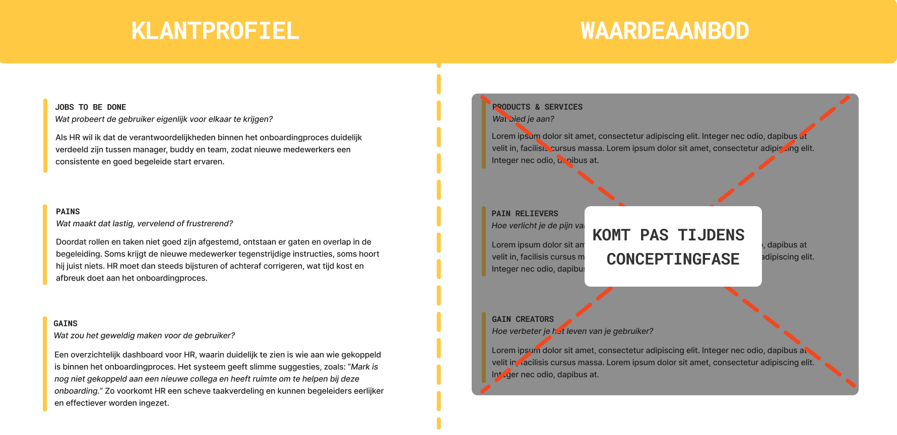

**Geen structurele feedback of meting van effect:**
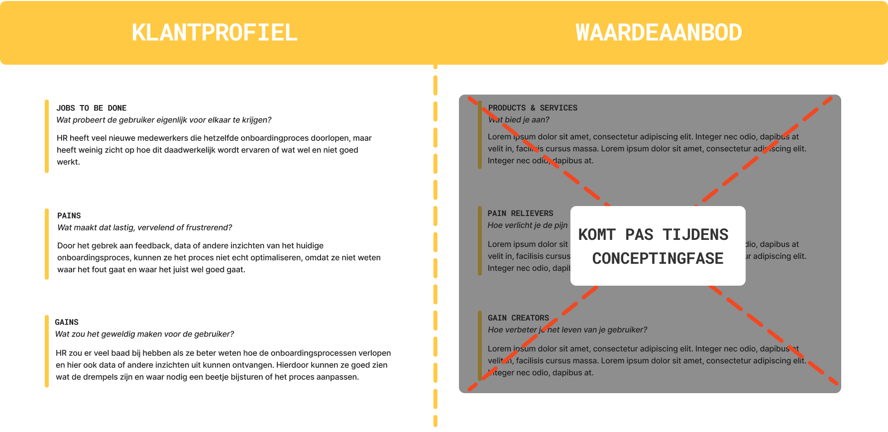

</TabItem>
<TabItem label="Tech en systematiek">
**Verouderde HR-systemen en versnipperde tools:**
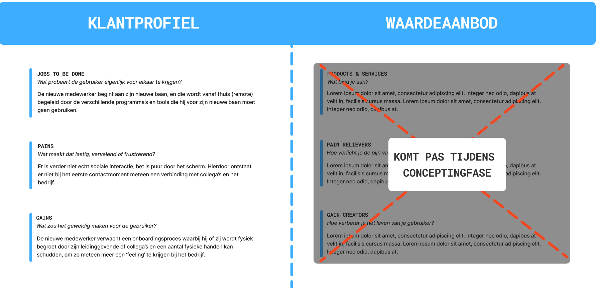

**Gebrek aan personalisatie:**
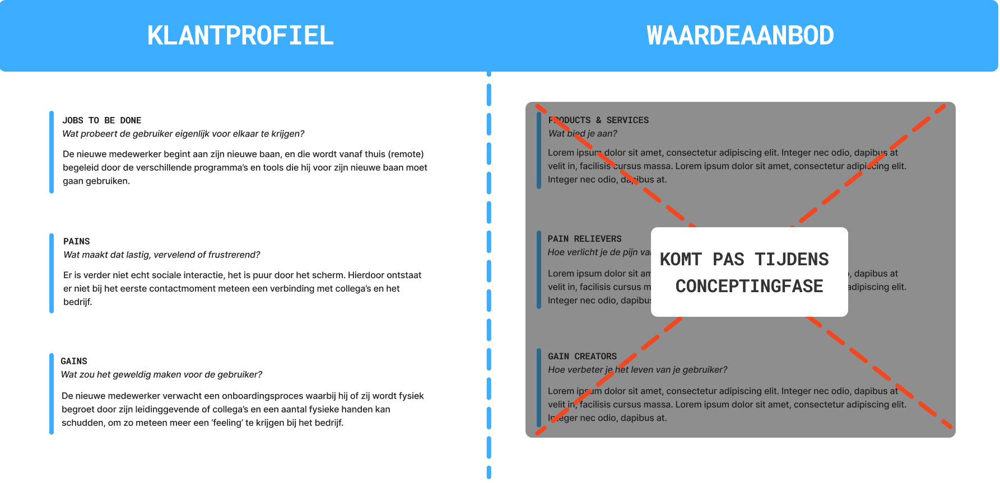

**Onboarding wordt gezien als een eenmalige fase:**
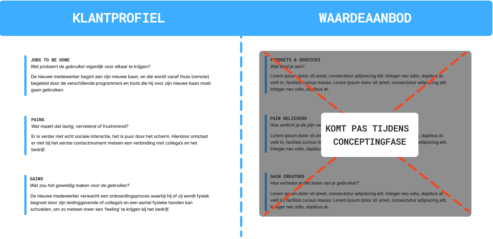

**AI of digitale tools voelen niet menselijk genoeg:**
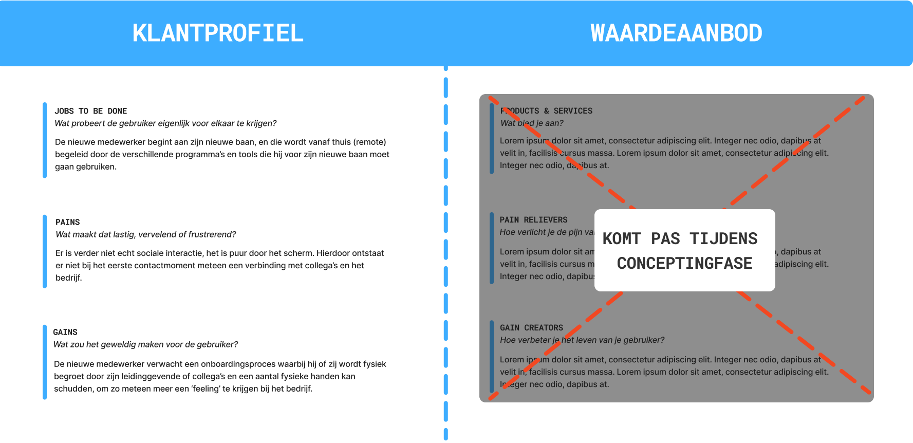

</TabItem>
</Tabs>
