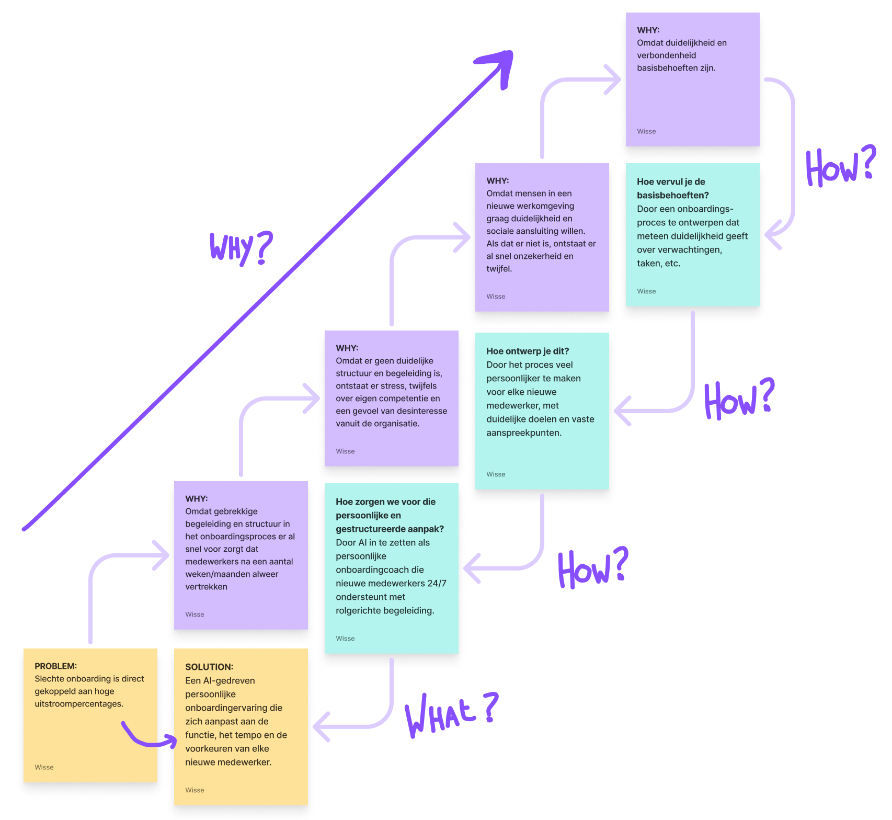
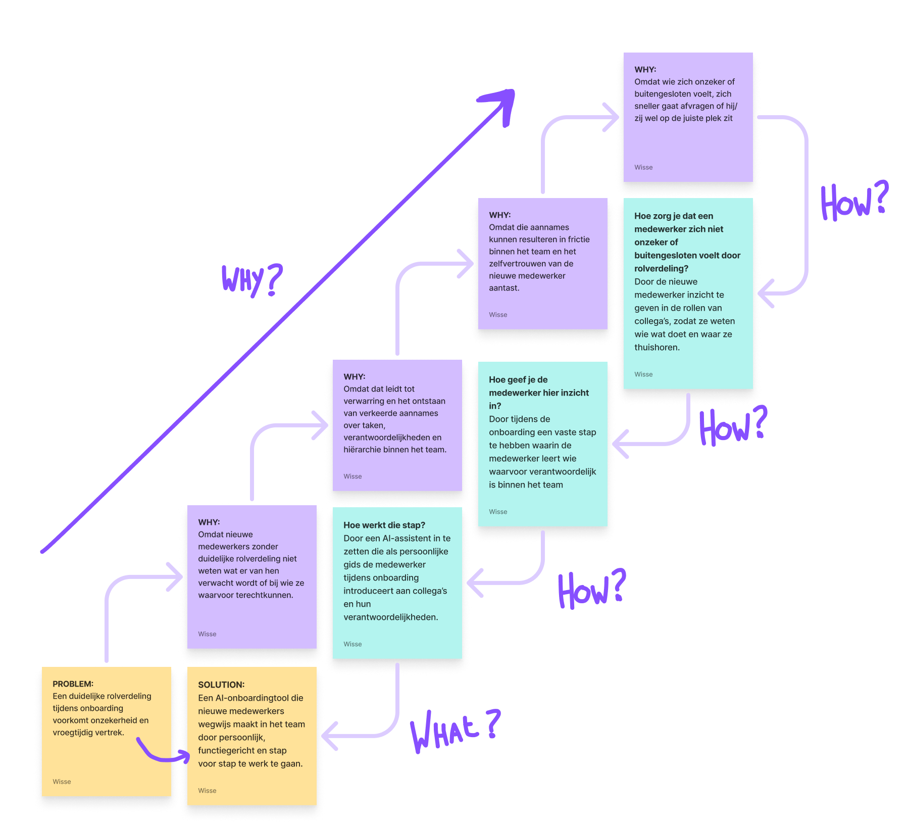
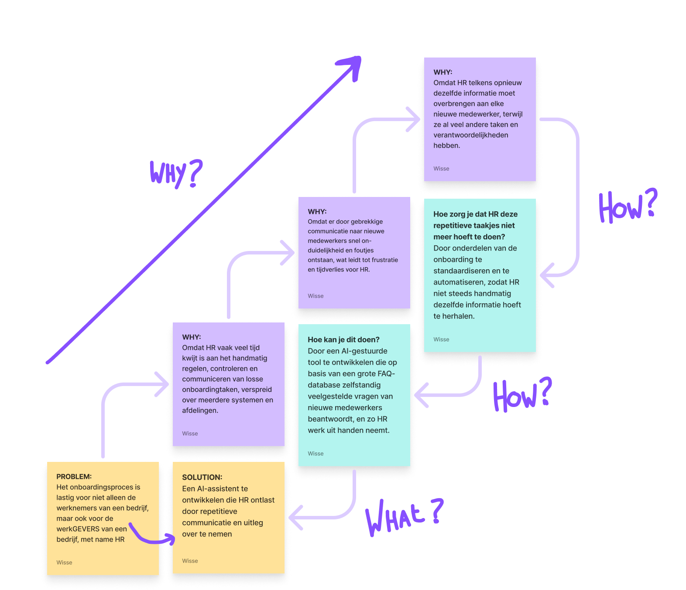
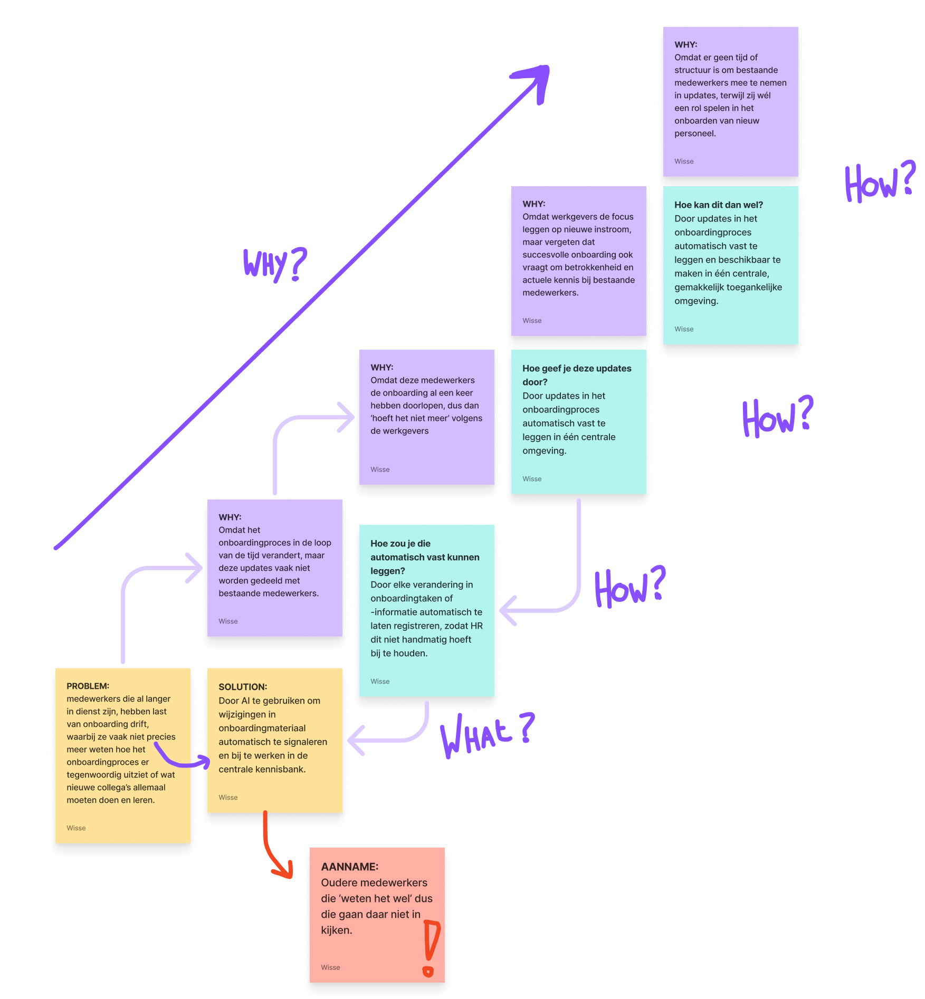
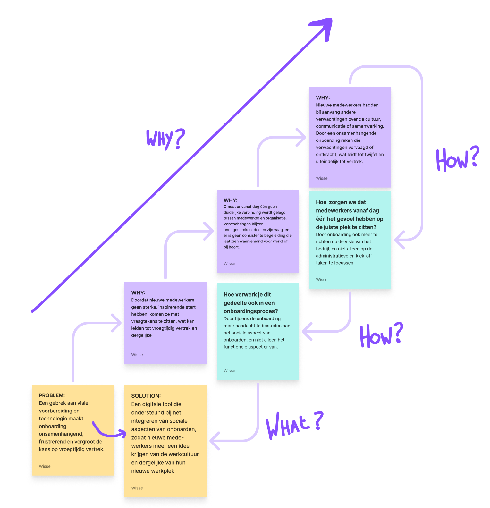
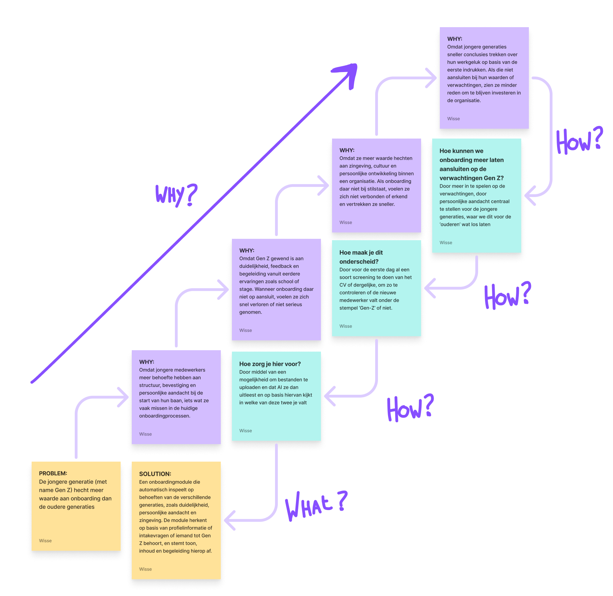
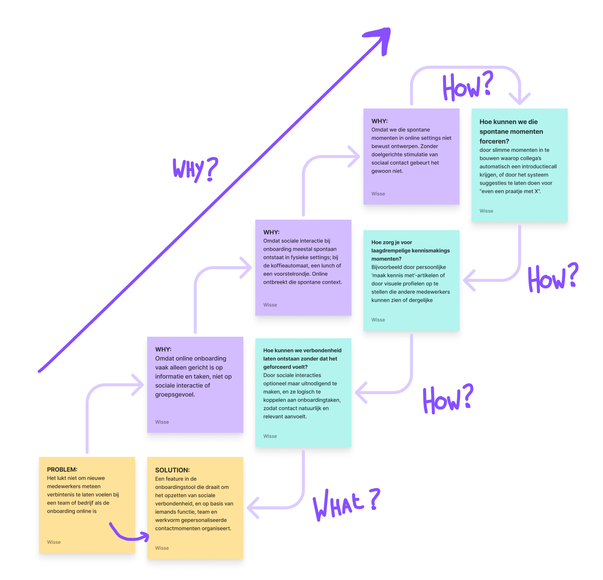
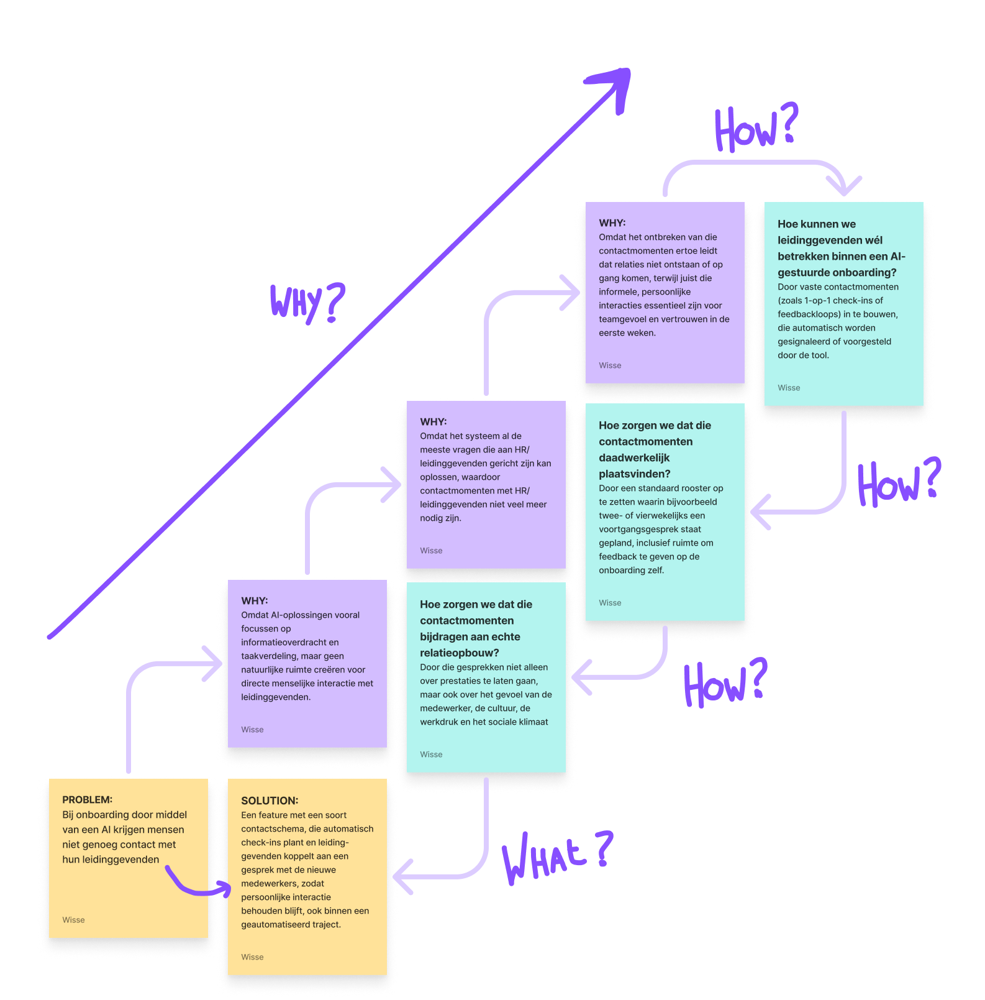

import whyHowLaddering from "../../../assets/why-how/whyhow1.png";
import whyHowLaddering2 from "../../../assets/why-how/whyhow2.png";
import whyHowLaddering3 from "../../../assets/why-how/whyhow3.png";
import whyHowLaddering4 from "../../../assets/why-how/whyhow4.png";
import whyHowLaddering5 from "../../../assets/why-how/whyhow5.png";
import whyHowLaddering6 from "../../../assets/why-how/whyhow6.png";
import whyHowLaddering7 from "../../../assets/why-how/whyhow7.png";
import whyHowLaddering8 from "../../../assets/why-how/whyhow8.png";

Om dieper in te gaan op de motivatie en behoeften achter gebruikersgedrag, maak
ik gebruik van de Why-How Laddering-methode. Deze methode helpt mij om het
'waarom' en 'hoe' achter gedrag of wensen van gebruikers te doorgronden. Zo kom
ik er niet alleen achter wát ze willen, maar vooral waarom ze dat belangrijk vinden.

Door steeds opnieuw te vragen: “Waarom is dit belangrijk?” of “Hoe bereik je dat
dan?”, ontstaat er een ongelooflijke diepgang. Zo kom ik van concrete observaties
tot diepere overtuigingen en ontwerpprincipes. Deze methode helpt me om te
voorkomen dat ik blijf hangen in onnodige toevoegingen, en dwingt mij om écht
te begrijpen waarom de gebruikers een bepaald gedrag vertonen.

Why-How Laddering helpt mij dus bij het omzetten van losse inzichten naar
onderbouwde ontwerpkeuzes.

### Aanpak

Ik heb **acht** Why-How Ladders opgesteld, waarbij de probleemstellingen zijn
gebaseerd op de frames die eerder zijn geformuleerd bij het maken van de
aannames, aangevuld met de knelpunten die naar voren kwamen uit zowel het
deskresearch als het fieldresearch.

De acht aannames en problemen waar deze methode op is toegepast, zijn als volgt:

1. Slechte onboarding is direct gekoppeld aan hoge uitstroompercentages.
2. Een duidelijke rolverdeling tijdens onboarding voorkomt onzekerheid en vroegtijdig vertrek.
3. Het onboardingsproces is lastig voor niet alleen de werknemers van een bedrijf, maar
   ook voor de werkGEVERS van een bedrijf, met name HR.
4. medewerkers die al langer in dienst zijn, hebben last van onboarding drift, waarbij
   ze vaak niet precies meer weten hoe het onboardingproces er tegenwoordig uitziet of wat
   nieuwe collega's allemaal moeten doen en leren.
5. Een gebrek aan visie, voorbereiding en technologie maakt onboarding onsamenhangend,
   frustrerend en vergroot de kans op vroegtijdig vertrek.
6. De jongere generatie (met name Gen Z) hecht meer waarde aan onboarding dan de oudere generaties.
7. Het lukt niet om nieuwe medewerkers meteen verbintenis te laten voelen bij een team of bedrijf
   als de onboarding online is.
8. Bij onboarding door middel van een AI krijgen mensen niet genoeg contact met hun leidinggevenden.

### Uitgewerkte Why-How Ladders

 
  
  
  
  
  
  
  
  
